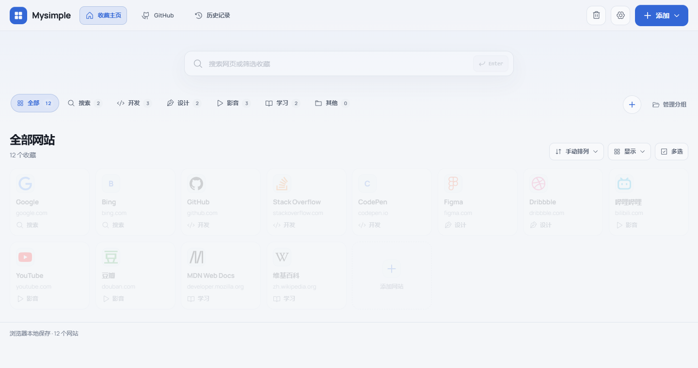

# Mysimple · 网站收藏

把常用网站、GitHub 仓库和浏览记录整理成一个顺手的浏览器起始页。

Mysimple 是一个以本地存储为主的网站收藏工具。你可以把链接按分组收好，搜索、拖动排序、批量移动，再用主题色、卡片布局和壁纸调整成自己的工作台。它既能作为网页运行，也能安装为 **Chrome / Edge 新标签页扩展**，无需注册账号或部署后端。

[下载扩展](https://github.com/DewMysimple/GuoYoung/releases/latest) · [安装指南](./EXTENSION_INSTALL.md) · [本地开发](#本地开发)



默认收藏示例，使用内置品牌图标。

## 可以用它做什么

- **整理网站收藏**：添加和编辑链接、自定义分组与图标、拖拽排序、跨组移动，以及批量选择和 Shift 范围选择。
- **快速找回链接**：搜索同时覆盖普通收藏和 GitHub 收藏；支持手动、名称、添加时间和点击热度排列。
- **集中管理 GitHub 收藏**：独立工作区收纳仓库、工具和文档；输入作者或组织主页，预览并导入公开仓库，后续刷新只追加新仓库。
- **浏览历史记录**：扩展版经授权后按站点聚合浏览记录，支持时间筛选、搜索、详情浏览和删除。
- **打造自己的新标签页**：浅色 / 深色主题、主题色、卡片密度、自定义品牌和本地 / 在线壁纸；设置可先预览再保存。
- **备份和分享**：导入 / 导出收藏 JSON，或单独分享一个分组的资源包；误删的网站可从回收站恢复。
- **随手收藏当前页**：扩展工具栏弹窗提供当前页收藏和浏览器书签管理、导入入口。

## 开始使用

### 安装浏览器扩展

1. 在 [GitHub Releases](https://github.com/DewMysimple/GuoYoung/releases/latest) 下载 `site-hub-extension.zip`，解压到一个长期保留的文件夹。
2. 打开 Chrome 的 `chrome://extensions/` 或 Edge 的 `edge://extensions/`，开启开发者模式。
3. 点击“加载已解压的扩展程序”，选择**直接包含 `manifest.json` 的文件夹**。
4. 打开一个新标签页，即可使用 Mysimple。

扩展安装后不需要本地服务器。更新时替换安装目录中的文件，再到扩展管理页点**重新加载**。详细步骤见[安装指南](./EXTENSION_INSTALL.md)。

### 网页版与扩展版的区别

| 能力 | 网页版 | Chrome / Edge 扩展版 |
| --- | --- | --- |
| 网站收藏、分组、搜索、外观设置 | 支持 | 支持 |
| GitHub 收藏与公开仓库导入 | 支持 | 支持 |
| 自动接管新标签页 | 不接管，可自行设为起始页 | 支持 |
| 工具栏收藏、浏览器书签管理 | 不支持 | 支持 |
| 浏览器历史记录 | 显示扩展版说明 | 授权后可用 |
| 搜索框按 Enter 搜索网页 | 使用 Google | 使用浏览器默认搜索引擎 |

两种形态的数据相互独立，可通过“设置 → 数据”中的导出 / 导入迁移。项目暂不提供账号登录和跨设备自动同步。

## 数据与隐私

收藏和设置保存在当前浏览器：网页版使用 `localStorage`，扩展版使用 `chrome.storage.local`；本地壁纸文件保存在 IndexedDB。不同浏览器、配置文件和网页地址的数据不会自动合并。

“本地存储”不代表完全离线：网站图标可能向目标站点、Google、DuckDuckGo 等图标服务发送请求；在线壁纸和品牌图片会访问所填地址；作者仓库导入访问 GitHub 公开 API，可能受到限流；网页搜索会交给搜索引擎。项目没有自建账户或数据同步服务器。

扩展的常驻权限为 `favicon`、`activeTab`、`bookmarks`、`search`、`storage`，另有 GitHub API 主机权限。浏览器历史使用**可选 `history` 权限**，拒绝授权不影响收藏。历史记录来自当前浏览器配置文件，删除一条 URL 会影响该 URL 在浏览器中的访问记录。

收藏备份包含活动收藏、分组和可导出的设置，**不包含回收站、搜索历史、浏览器历史或本地壁纸文件**；本地壁纸迁移后需重新选择。清理浏览器数据或移除扩展前，请先导出需要保留的收藏。

## 本地开发

使用 Node.js **22.12+ 的 22.x，或 24.x**，并安装依赖：

```bash
git clone https://github.com/DewMysimple/GuoYoung.git
cd GuoYoung
npm ci
npm run dev
```

打开终端显示的地址，默认是 `http://localhost:5173`。Windows 双击 `runStart.cmd` 也可启动已安装依赖的项目；在 PowerShell 中如遇执行策略限制，将 `npm` 写为 `npm.cmd`。

| 命令 | 用途 |
| --- | --- |
| `npm run dev` | 开发服务器 |
| `npm run typecheck` | TypeScript 类型检查 |
| `npm test` | 单元与组件测试 |
| `npm run test:watch` | 监听模式运行单元测试 |
| `npm run test:e2e -- --workers=1` | 桌面 Chrome 与 Pixel 7 模拟设备回归 |
| `npm run build` | 类型检查并生成网页版 `dist/` |
| `npm run preview` | 本地预览网页生产构建 |
| `npm run build:extension` | 生成扩展版 `dist-extension/` |
| `npm run package:extension` | 构建扩展并生成 `artifacts/site-hub-extension.zip`，需要 PowerShell |
| `npm run capture` | 对运行在 4173 端口的页面做浏览器截图巡检 |
| `npm run lint:wiki` | 校验工程记忆的格式、链接与索引 |

E2E 和截图使用 Chrome：未安装时运行 `npx playwright install chrome`。E2E 会启动 4173 端口的测试服务器；截图前可运行 `npm run preview -- --host 127.0.0.1 --port 4173`。详细验证记录见[测试与验证基线](./Wiki/测试与验证基线.md)。

网页版可将 `dist/` 部署到静态服务器的站点根路径；不要直接双击其中的 HTML。部署到子路径时需相应调整 Vite 的 `base`。本地打包扩展也可双击 `buildStart.cmd`，再按安装指南加载生成目录。

## 工程结构

技术栈为 React 19、TypeScript、Vite 7、Tailwind CSS 4；使用 dnd-kit 处理排序，Vitest 与 Playwright 验证逻辑和交互。

```text
src/
  App.tsx          主应用与交互编排
  components/      收藏、分组、历史、设置等界面
  hooks/           收藏状态、主题和壁纸 hooks
  lib/             业务函数、存储迁移、浏览器与 GitHub API 适配
  data/            默认收藏、分组与图标选项
  popup/           扩展工具栏弹窗
  background.ts    扩展后台事件桥接
public/            静态资源与扩展 manifest
e2e/               浏览器回归测试
scripts/           打包、截图与 Wiki 校验脚本
docs/images/       README 展示图片
Wiki/              架构、契约、决策与工作日志
artifacts/         本地交付与验收资料（产物不入 Git）
.github/workflows/ 自动验证与扩展 Release 发布
```

单元测试就近放在被测源码旁。`dist/`、`dist-extension/`、测试报告和依赖目录均为生成物，不提交到源码仓库。目录维护和后续拆分建议见[工程维护清单](./Wiki/工程维护清单.md)。

扩展版本以 `public/manifest.json` 为准；npm 包名 `site-hub` 和存储键 `site-hub:v1` 是内部兼容标识。发布工作流由版本标签触发，构建 ZIP 并上传 GitHub Release；源码最新状态可能领先于已发布安装包。

## 参与开发

提交问题时，请说明浏览器、网页 / 扩展形态、复现步骤，以及实际和预期表现。[AGENTS.md](./AGENTS.md) 记录协作规则，[项目知识入口](./Wiki/MOC_项目知识.md) 和[当前状态](./Wiki/当前状态.md) 记录项目约束与已知问题。

项目目前没有附带开源许可证；代码使用和再分发授权需与作者确认。
